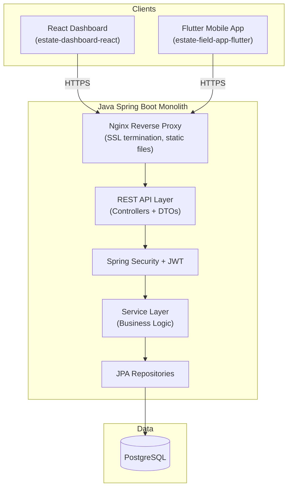

# Estate ERP — Final Architecture & API Specification

## Architecture Overview

Since only ~10 users will access this system (dashboard admins + field supervisors on mobile), a **single Spring Boot monolith** is the right call. No need for microservices overhead at this scale.

### Why a Monolith?
- **10 users** → zero need for horizontal scaling or message brokers yet.
- **Single deploy** → one `docker-compose up` spins up Nginx + Spring Boot + Postgres.
- **Simpler debugging** → no distributed tracing needed.
- **Easy to split later** → clean service-layer separation means you can extract a microservice if the estate grows.

> [!NOTE]
> The Go/Python services from your original plan remain valid for `Phase 2` of the product (IoT + AI). When you're ready, the Spring Boot app can publish events to RabbitMQ and those services subscribe.

---

## API Endpoint Specification

Base URL: `/api/v1`

All endpoints return JSON. Authenticated via `Authorization: Bearer <jwt>` header (except login/register).

---

### 1. Authentication (`/api/v1/auth`)

| Method | Endpoint | Purpose |
|--------|----------|---------|
| `POST` | `/auth/login` | Login → returns JWT token |
| `POST` | `/auth/register` | Register new user (admin-only) |
| `GET`  | `/auth/me` | Get current user profile |
| `PUT`  | `/auth/change-password` | Change own password |

---

### 2. Employees (`/api/v1/employees`)

| Method | Endpoint | Purpose |
|--------|----------|---------|
| `GET`    | `/employees` | List all employees (paginated) |
| `GET`    | `/employees/{id}` | Get employee details |
| `POST`   | `/employees` | Create new employee |
| `PUT`    | `/employees/{id}` | Update employee info |
| `DELETE` | `/employees/{id}` | Soft-delete employee |
| `GET`    | `/employees/{id}/loans` | List loans for an employee |
| `GET`    | `/employees/{id}/transactions` | List transactions for an employee |
| `GET`    | `/employees/{id}/attendance` | Attendance history for employee |

---

### 3. Employee Loans (`/api/v1/employee-loans`)

| Method | Endpoint | Purpose |
|--------|----------|---------|
| `GET`    | `/employee-loans` | List all active loans |
| `POST`   | `/employee-loans` | Issue a new loan to an employee |
| `GET`    | `/employee-loans/{id}` | Get loan details |
| `PUT`    | `/employee-loans/{id}` | Update loan (e.g., mark inactive) |

---

### 4. Attendance (`/api/v1/attendance`)

| Method | Endpoint | Purpose |
|--------|----------|---------|
| `GET`    | `/attendance` | List attendance (filterable by date range, employee) |
| `POST`   | `/attendance` | Record attendance entry |
| `POST`   | `/attendance/bulk` | Bulk record daily attendance for all workers |
| `PUT`    | `/attendance/{id}` | Update an attendance record |
| `DELETE` | `/attendance/{id}` | Delete an attendance record |

---

### 5. Loads (`/api/v1/loads`)

| Method | Endpoint | Purpose |
|--------|----------|---------|
| `GET`    | `/loads` | List all loads (filterable by date) |
| `POST`   | `/loads` | Start a new load |
| `GET`    | `/loads/{id}` | Get load details (with latex records, metrolac, rubber solid) |
| `PUT`    | `/loads/{id}` | Update load (e.g., set end date) |
| `DELETE` | `/loads/{id}` | Delete a load |

---

### 6. Latex Records (`/api/v1/latex-records`)

| Method | Endpoint | Purpose |
|--------|----------|---------|
| `GET`    | `/latex-records` | List all latex records (filterable by load, employee) |
| `POST`   | `/latex-records` | Record a latex collection entry |
| `PUT`    | `/latex-records/{id}` | Update a latex record |
| `DELETE` | `/latex-records/{id}` | Delete a record |

---

### 7. Metrolac Readings (`/api/v1/metrolac-readings`)

| Method | Endpoint | Purpose |
|--------|----------|---------|
| `GET`    | `/metrolac-readings` | List readings (filterable by load) |
| `POST`   | `/metrolac-readings` | Add a new metrolac reading |
| `PUT`    | `/metrolac-readings/{id}` | Update a reading |

---

### 8. Ammonia Records (`/api/v1/ammonia-records`)

| Method | Endpoint | Purpose |
|--------|----------|---------|
| `GET`    | `/ammonia-records` | List ammonia records |
| `POST`   | `/ammonia-records` | Record ammonia refill or usage |

---

### 9. Rubber Solid Records (`/api/v1/rubber-solid-records`)

| Method | Endpoint | Purpose |
|--------|----------|---------|
| `GET`    | `/rubber-solid-records` | List rubber solid records |
| `POST`   | `/rubber-solid-records` | Add a rubber solid weight record |

---

### 10. Monetary Assets (`/api/v1/monetary-assets`)

| Method | Endpoint | Purpose |
|--------|----------|---------|
| `GET`    | `/monetary-assets` | List all asset transactions |
| `GET`    | `/monetary-assets/balances` | Current balance per asset type (Cash, BOC, Peoples, Seylan) |
| `POST`   | `/monetary-assets` | Record a money-in or money-out transaction |

---

### 11. Estate Loans (`/api/v1/estate-loans`)

| Method | Endpoint | Purpose |
|--------|----------|---------|
| `GET`    | `/estate-loans` | List all estate loan transactions |
| `GET`    | `/estate-loans/balances` | Current balance per loan type |
| `POST`   | `/estate-loans` | Record a loan transaction |

---

### 12. Sales — Latex (`/api/v1/sales/latex`)

| Method | Endpoint | Purpose |
|--------|----------|---------|
| `GET`    | `/sales/latex` | List all latex sales |
| `POST`   | `/sales/latex` | Record a new latex sale |
| `PUT`    | `/sales/latex/{id}` | Update sale (e.g., mark payment received) |
| `PUT`    | `/sales/latex/{id}/receive-payment` | Mark payment received and link to a monetary asset transaction |

---

### 13. Expenses (`/api/v1/expenses`)

| Method | Endpoint | Purpose |
|--------|----------|---------|
| `GET`    | `/expenses` | List all expenses (filterable by type, date range) |
| `POST`   | `/expenses` | Record an expense (auto-links to asset or estate loan) |
| `GET`    | `/expenses/{id}` | Get expense details |

---

### 14. Employee Transactions (`/api/v1/employee-transactions`)

| Method | Endpoint | Purpose |
|--------|----------|---------|
| `GET`    | `/employee-transactions` | List all (filterable by employee, type, date) |
| `POST`   | `/employee-transactions` | Record a transaction (advance, manual labor, loan payment, latex tap) |

---

### 15. Dashboard / Reports (`/api/v1/dashboard`)

| Method | Endpoint | Purpose |
|--------|----------|---------|
| `GET`    | `/dashboard/summary` | Overall estate summary (cash, outstanding loans, today's collection) |
| `GET`    | `/dashboard/daily-report?date=` | Full daily operations report |
| `GET`    | `/dashboard/monthly-payroll?month=&year=` | Monthly payroll summary for all employees |
| `GET`    | `/dashboard/export/payroll?month=&year=&format=pdf` | Download payroll as PDF/Excel |

---

## Current Progress & Detailed Implementation Plan

The project is currently partially completed. The foundation, database schema, containerization, and data access layer (JPA) are fully implemented. We are now ready to implement the business logic (Services) and the API layer (Controllers).

### ✅ Completed Work (Phase 1 & 2)

**1. Foundation Setup & Containerization**
- Scaffolded Spring Boot 3 Maven project with Java 21.
- Created [docker-compose.yml](file:///e:/Porjects/Madukotawatte%20ERP/estate-erp-service-java/docker-compose.yml) defining three services:
  - `app`: The Spring Boot backend.
  - `db`: PostgreSQL 16 database.
  - `nginx`: Reverse proxy running on port 80.
- Implemented Multi-stage [Dockerfile](file:///e:/Porjects/Madukotawatte%20ERP/estate-erp-service-java/Dockerfile) (Maven build stage + optimal JRE runtime stage) running under a non-root user (`estate`).
- Configured Nginx ([nginx.conf](file:///e:/Porjects/Madukotawatte%20ERP/estate-erp-service-java/nginx/nginx.conf)) to conditionally route `/api/`, `/swagger-ui/`, and `/api-docs` to the Spring application.
- Configured [application.yml](file:///e:/Porjects/Madukotawatte%20ERP/estate-erp-service-java/src/main/resources/application.yml) for PostgreSQL dialects, Hibernate automatic schema validation (set to `validate`), and HikariCP connection pooling.

**2. Database Migration & Schema (Flyway)**
- Implemented [V1__init_schema.sql](file:///e:/Porjects/Madukotawatte%20ERP/estate-erp-service-java/src/main/resources/db/migration/V1__init_schema.sql) defining 12 tables representing the entire ERP data model (Employees, Assets, Loans, Attendance, Loads, Records, Transactions, Expenses).
- Fixed a schema issue where `VARCHAR(36)` was used for UUID references instead of `CHAR(36)` to match Hibernate's expectations.
- Implemented [V2__seed_data.sql](file:///e:/Porjects/Madukotawatte%20ERP/estate-erp-service-java/src/main/resources/db/migration/V2__seed_data.sql) to populate initial users (`admin`, `supervisor`), sample employees, and starting bank balances for local testing.

**3. JPA Entities & Repositories**
- Fully implemented all JPA Entities (`@Entity`) with corresponding PostgreSQL table mappings.
- Entities include: [Employee](file:///e:/Porjects/Madukotawatte%20ERP/estate-erp-service-java/src/main/java/com/madukotawatte/erp/entity/Employee.java#9-28), [User](file:///e:/Porjects/Madukotawatte%20ERP/estate-erp-service-java/src/main/java/com/madukotawatte/erp/entity/User.java#6-31), [EmployeeLoan](file:///e:/Porjects/Madukotawatte%20ERP/estate-erp-service-java/src/main/java/com/madukotawatte/erp/entity/EmployeeLoan.java#8-36), [Load](file:///e:/Porjects/Madukotawatte%20ERP/estate-erp-service-java/src/main/java/com/madukotawatte/erp/entity/Load.java#8-26), [Attendance](file:///e:/Porjects/Madukotawatte%20ERP/estate-erp-service-java/src/main/java/com/madukotawatte/erp/entity/Attendance.java#8-30), [MetrolacReading](file:///e:/Porjects/Madukotawatte%20ERP/estate-erp-service-java/src/main/java/com/madukotawatte/erp/entity/MetrolacReading.java#9-27), [LatexRecord](file:///e:/Porjects/Madukotawatte%20ERP/estate-erp-service-java/src/main/java/com/madukotawatte/erp/entity/LatexRecord.java#9-38), [AmmoniaRecord](file:///e:/Porjects/Madukotawatte%20ERP/estate-erp-service-java/src/main/java/com/madukotawatte/erp/entity/AmmoniaRecord.java#9-27), [RubberSolidRecord](file:///e:/Porjects/Madukotawatte%20ERP/estate-erp-service-java/src/main/java/com/madukotawatte/erp/entity/RubberSolidRecord.java#8-24), [MonetaryAssetTransaction](file:///e:/Porjects/Madukotawatte%20ERP/estate-erp-service-java/src/main/java/com/madukotawatte/erp/entity/MonetaryAssetTransaction.java#8-31), [EstateLoanTransaction](file:///e:/Porjects/Madukotawatte%20ERP/estate-erp-service-java/src/main/java/com/madukotawatte/erp/entity/EstateLoanTransaction.java#8-27), [SalesLatex](file:///e:/Porjects/Madukotawatte%20ERP/estate-erp-service-java/src/main/java/com/madukotawatte/erp/entity/SalesLatex.java#8-43), [Expense](file:///e:/Porjects/Madukotawatte%20ERP/estate-erp-service-java/src/main/java/com/madukotawatte/erp/entity/Expense.java#9-38), [EmployeeTransaction](file:///e:/Porjects/Madukotawatte%20ERP/estate-erp-service-java/src/main/java/com/madukotawatte/erp/entity/EmployeeTransaction.java#9-31).
- Fully implemented Spring Data JPA [Repository](file:///e:/Porjects/Madukotawatte%20ERP/estate-erp-service-java/src/main/java/com/madukotawatte/erp/repository/LoadRepository.java#11-15) interfaces for all entities.

---

### ⏳ Remaining Work (Phases 3 - 6)

**Phase 3: Service Layer (Business Logic)** *<-- WE ARE HERE*
- Create `WorkforceService`: Handle employee CRUD, loan issuance, and attendance tracking logic.
- Create `DailyOperationsService`: Handle starting/ending loads, recording latex amounts, metrolac readings, ammonia usage, and rubber solid weights.
- Create `FinanceService`: Handle monetary asset transactions (money in/out), estate loans, latex sales, and recording expenses.
- Create `PayrollService`: Calculate monthly payrolls, considering manual labor entries, advances, loan deductions, and latex tapping income over the month.

**Phase 4: REST Controllers & DTOs**
- Implement standard REST Controllers mapped to `/api/v1/*`.
- Create Request and Response DTOs (Data Transfer Objects) to decouple the API from the JPA entities.
- Controllers to build: `EmployeeController`, `AttendanceController`, `OperationsController` (Loads/Latex/etc.), `FinanceController`, and `TransactionController`.

**Phase 5: Security (Spring Security + JWT)**
- Configure stateless Spring Security.
- Implement JWT generation and validation filter.
- Create `AuthController` to handle login and registration.
- Secure specific endpoints (e.g., only `ROLE_ADMIN` can manage system users, while `ROLE_SUPERVISOR` can input daily records).

**Phase 6: Dashboard & Reports**
- Create `DashboardController` for aggregated summary data (total cash, total latex today).
- Implement PDF generation using Apache PDFBox or JasperReports for payroll / monthly performance summaries.
- Enable `springdoc-openapi-starter-webmvc-ui` to auto-generate the Swagger documentation.

## Verification Plan

### Automated Tests
- JUnit 5 + Mockito unit tests for `FinanceService` and `PayrollService`.
- Integration tests with Testcontainers (Postgres) for full CRUD flows.

### Manual Verification
- Start locally with `./mvnw spring-boot:run`.
- Use **Swagger UI** at `http://localhost:8080/swagger-ui.html` to manually test all endpoints.
